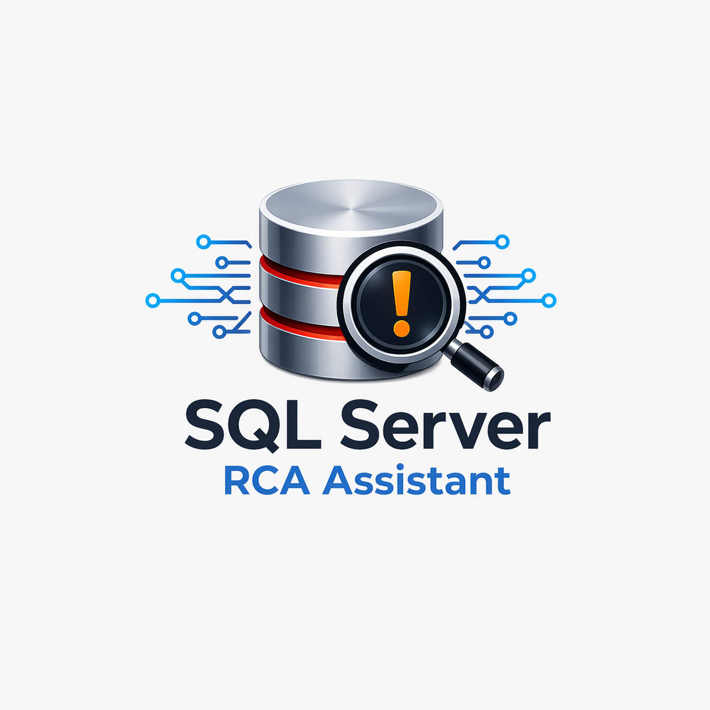
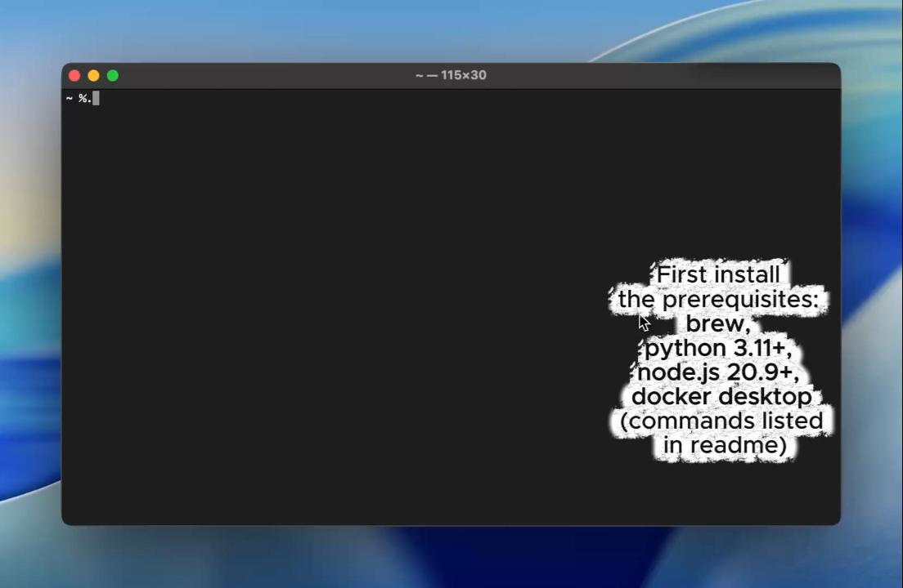
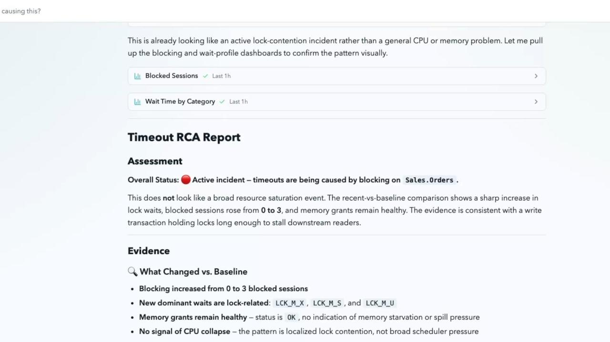
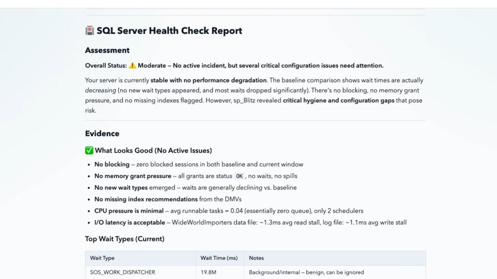

<div align="center">
  <h1>SQL Server RCA Assistant</h1>
  
</div>

SQL Server RCA Assistant is a local-first tool that helps you understand why your database, or your app, is slow.

It combines SQL Server diagnostics, lightweight monitoring, and an AI-driven investigation layer to turn raw signals such as waits, queries, blocking, and resource pressure into clear root-cause explanations and actionable next steps.

Unlike traditional tools, it does not stop at the database. It can also connect performance issues back to your application code, helping you understand which queries, endpoints, or ORM patterns are actually causing the slowdown.

Whether you are an accidental DBA debugging a production issue or a professional DBA doing deep performance analysis, it helps you go from "something is slow" to "this is the cause and here is what to fix."


## Video Walkthroughs

The thumbnails below open full demo videos hosted in GitHub Releases. Depending on your browser settings, the video may play in a new tab or download directly. Click on an image to play each video.

### End-to-End Installation Walkthrough

[](https://github.com/dzigz/sql-server-rca-assistant/releases/download/readme-demo-videos/installation_demo.mp4)

### Live Incident RCA Walkthrough

[](https://github.com/dzigz/sql-server-rca-assistant/releases/download/readme-demo-videos/incident_demo.mp4)

### Database Health Review Walkthrough

[](https://github.com/dzigz/sql-server-rca-assistant/releases/download/readme-demo-videos/db_health_demo.mp4)

## What It Does

- Connects directly to your SQL Server instance and runs proven diagnostics such as First Responder Kit-style checks
- Surfaces key signals: waits, blocking chains, top queries, memory pressure, CPU, and I/O
- Optionally collects telemetry into ClickHouse for baseline-vs-incident comparison
- Explains likely root causes in plain language, with supporting evidence
- Prioritizes contributing factors instead of dumping raw metrics
- Suggests concrete next steps and fixes, not just observations
- Optionally uses `--repo-path` to correlate database issues with:
  - application endpoints or features
  - query paths and ORM-generated SQL
  - inefficient patterns such as N+1 queries, missing batching, and over-fetching
- The system was verified on both straightforward SQL Server incidents and more complex cascading failure patterns, including cases where one bottleneck leads to secondary symptoms that can distract diagnosis. Examples include: blocking chains, deadlocks, parameter sniffing, missing-index regressions, CPU pressure, tempdb spills, memory grant queueing, log write stalls, statistics regressions, hot-partition contention, and I/O storm cascades

## Example Questions You Can Ask

- "CPU spiked at 09:40. What caused it?"
- "Users are hitting timeouts: blocking, memory, or bad plans?"
- "What changed compared to baseline?"
- "Why is the database slow right now?"
- "My invoices page is slow. Where in the code and queries is the bottleneck?"

## Manual (Start Here)

### Get the Code
- If you already have this repository on disk, skip this step.
- If you are comfortable with Git:

```bash
git clone https://github.com/dzigz/sql-server-rca-assistant.git
cd sql-server-rca-assistant
```

- If you are not using Git yet, download the repository as a ZIP from GitHub, unzip it, then open Terminal in the extracted `sql-server-rca-assistant` folder.

### Prerequisites
- Primary tested environment is macOS, hence the documented prerequisites setup is currently macOS-focused. Linux and Windows should work by installing the same prerequisites.
- Homebrew is the recommended package manager on macOS. If you do not have it yet:

```bash
xcode-select --install
/bin/bash -c "$(curl -fsSL https://raw.githubusercontent.com/Homebrew/install/HEAD/install.sh)"
```

Then follow the `brew shellenv` command printed by the installer so `brew` is available in your shell.

- Python 3.11+

```bash
brew install python@3.11
python3.11 --version
```

You should see `Python 3.11.x` or newer.

- Node.js 20.9+

```bash
brew install node@24
echo 'export PATH="$(brew --prefix node@24)/bin:$PATH"' >> ~/.zshrc
source ~/.zshrc
node --version
npm --version
```

Any `node` version `>= 20.9.0` is fine.

- Docker Desktop/Engine running (default setup)

```bash
brew install --cask docker-desktop
open -a Docker
docker info
docker compose version
```

Wait until Docker Desktop is fully started before running the app. `docker info` confirms the Docker daemon is up, and Docker Desktop already includes Docker Compose.

- A reachable SQL Server instance and credentials with diagnostic permissions
- An Anthropic API key for AI-driven analysis. Without `ANTHROPIC_API_KEY`, the app can start but RCA chat analysis will fail when you send a message.

### Install Dependencies

```bash
# From repo root
python3.11 -m venv sim/.venv
source sim/.venv/bin/activate
python -m pip install --upgrade pip
python -m pip install -r sim/requirements.txt
npm --prefix sim/webapp/frontend install
```

### Create a Local Config File
- The app automatically loads `sim/.env` if it exists. This is the easiest setup for repeated local use.

```bash
cp sim/.env.example sim/.env
```

- Edit `sim/.env` and set at least:

```dotenv
SQLSERVER_HOST=your-sqlserver-host
SQLSERVER_PORT=1433
SQLSERVER_USER=sa
SQLSERVER_PASSWORD=your-password
SQLSERVER_DATABASE=master
ANTHROPIC_API_KEY=sk-ant-...
```

- You can still use shell `export` commands instead of `sim/.env` if you prefer. The resulting values are the same.

### SQL Permissions Note
- Your SQL login must be able to run the diagnostic queries used by the app.
- By default, the app auto-installs First Responder Kit / Blitz procedures if they are missing. That means the login may also need permission to create procedures in `master`.
- If your environment does not allow that, either pre-install the procedures separately or start with `--no-auto-install-blitz`.

### Simplest First Run (No Docker)
- If you want the fastest first-time setup and only need direct SQL diagnostics, skip the monitoring stack:

```bash
python -m sim webapp start --no-monitoring-stack --no-monitoring
```

- This mode starts the web app without ClickHouse, Grafana, or Docker.
- Open [http://localhost:3000](http://localhost:3000).

### Start Everything (Full Monitoring Stack)

```bash
python -m sim webapp start
```

This default command:
- starts ClickHouse + collector + Grafana monitoring stack
- enables monitoring tools for analysis
- auto-installs FRK/Blitz scripts if missing
- uses Grafana only for optional dashboards (not required for RCA chat flow)
- prints Grafana login in terminal at startup

Monitoring notes:
- Docker Desktop/Engine must already be running for the default startup path.
- The bundled monitoring stack does not include a SQL Server instance. The DMV collector connects to your existing SQL Server target using the `SQLSERVER_*` settings you configured.
- Verify Docker before starting:

```bash
docker info
docker compose version
```

- The bundled monitoring stack exposes:
  - `8123` ClickHouse
  - `8080` DMV collector health API
  - `3001` Grafana
- After startup, you can verify the monitoring services are healthy with:

```bash
curl http://localhost:8080/health
curl http://localhost:3001/api/health
```

- If Docker is unavailable and you want direct SQL diagnostics only, run:

```bash
python -m sim webapp start --no-monitoring-stack --no-monitoring
```

- If you want to skip starting the bundled containers but keep monitoring defaults in the app, run:

```bash
python -m sim webapp start --no-monitoring-stack
```

- Use `--no-monitoring-stack` only if ClickHouse and the DMV collector are already running and reachable through the configured `CLICKHOUSE_*` settings.
- Monitoring-backed chat analysis needs baseline data before recent-vs-baseline comparisons are meaningful. Plan to wait about 10-15 minutes after the collector starts.
- Direct SQL diagnostics such as `sp_Blitz` and server configuration checks work immediately; they do not require the monitoring stack.

### Optional: Enable Application Code Analysis

```bash
python -m sim webapp start --repo-path /absolute/path/to/your/application
```

Code analysis notes:
- Providing `--repo-path` makes application-side correlation tools available in chat.
- These tools can help identify where a slow query originates, correlate an incident with recent code changes, and detect ORM anti-patterns.
- `claude-agent-sdk` is required for code analysis tools.
- If you installed dependencies with `python -m pip install -r sim/requirements.txt`, `claude-agent-sdk` is already included.
- If you installed from package metadata instead of `requirements.txt`, install the optional extra with:

```bash
python -m pip install '.[code_analysis]'
```

- On startup, verify code analysis is active by checking for a terminal line like `Code Analysis: Enabled (/absolute/path/to/your/application)`.

### Open the App and Run Analysis
- Open [http://localhost:3000](http://localhost:3000).
- Create a session for your SQL Server target.
- Ask for analysis of the issue you are seeing (for example: "CPU spikes started at 09:40 UTC, analyze likely root causes and next checks").
- The assistant runs SQL Server diagnostics and returns RCA + recommended actions.
- Optional dashboards: open `http://localhost:3001` and sign in with `admin` plus the password printed by startup.

### Optional: Run Without Monitoring Stack

```bash
python -m sim webapp start --no-monitoring-stack --no-monitoring
```

### Stop Services

```bash
# Stop web app/backend process
# (Ctrl+C in the terminal where you started it)

# Stop monitoring containers
docker compose -f sim/docker/docker-compose.yaml down
```

### Monitoring Troubleshooting

```bash
docker compose -f sim/docker/docker-compose.yaml ps
docker compose -f sim/docker/docker-compose.yaml logs dmv-collector
docker compose -f sim/docker/docker-compose.yaml logs clickhouse
docker compose -f sim/docker/docker-compose.yaml down
```

### First-Run Troubleshooting
- If chat analysis fails immediately, verify `ANTHROPIC_API_KEY` is set in `sim/.env` or your shell.
- If the default startup path fails, verify Docker Desktop is running with `docker info`.
- If Blitz installation fails, your SQL login may not have enough permission to install procedures in `master`; retry with `--no-auto-install-blitz` or pre-install the scripts with a higher-privilege login.
- If ports are already in use, start the app on different ports with `python -m sim webapp start --backend-port 8001 --frontend-port 3002`.

## Command Options

- `--no-monitoring-stack`: do not run docker compose stack
- `--no-monitoring`: SQL-direct mode only (no ClickHouse tools)
- `--no-auto-install-blitz`: skip automatic FRK install

## Docs

- App guide: `sim/README.md`
- Web app details: `sim/webapp/README.md`
- Optional monitoring stack: `sim/docker/README.md`

## License

MIT
