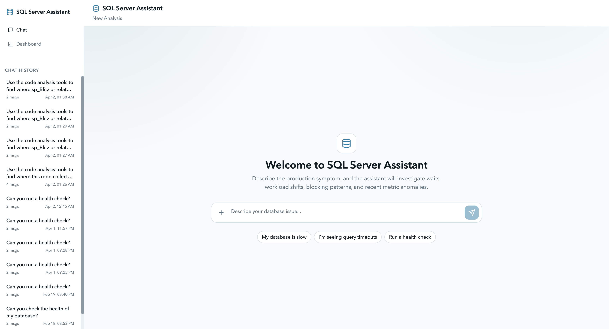

# SQL Server RCA Assistant

SQL Server RCA Assistant is a local-first tool that helps you understand why your database, or your app, is slow.

It combines SQL Server diagnostics, lightweight monitoring, and an AI-driven investigation layer to turn raw signals such as waits, queries, blocking, and resource pressure into clear root-cause explanations and actionable next steps.

Unlike traditional tools, it does not stop at the database. It can also connect performance issues back to your application code, helping you understand which queries, endpoints, or ORM patterns are actually causing the slowdown.

Whether you are an accidental DBA debugging a production issue or a professional DBA doing deep performance analysis, it helps you go from "something is slow" to "this is the cause and here is what to fix."



## What It Does

- Connects directly to your SQL Server instance and runs proven diagnostics such as First Responder Kit-style checks
- Surfaces key signals: waits, blocking chains, top queries, memory pressure, CPU, and I/O
- Optionally collects telemetry into ClickHouse for baseline-vs-incident comparison
- Explains likely root causes in plain language, with supporting evidence
- Prioritizes contributing factors instead of dumping raw metrics
- Suggests concrete next steps and fixes, not just observations
- Optionally uses `--repo-path` to correlate database issues with:
  - application endpoints or features
  - query paths and ORM-generated SQL
  - inefficient patterns such as N+1 queries, missing batching, and over-fetching

## Example Questions You Can Ask

- "CPU spiked at 09:40. What caused it?"
- "Users are hitting timeouts: blocking, memory, or bad plans?"
- "What changed compared to baseline?"
- "Why is the database slow right now?"
- "My invoices page is slow. Where in the code and queries is the bottleneck?"

## Manual (Start Here)

1. Prerequisites
- Python 3.11+
- Node.js 20.9+
- Docker Desktop/Engine running (default setup)
- A reachable SQL Server instance and credentials with diagnostic permissions

2. Install dependencies

```bash
# From repo root
python3.11 -m venv sim/.venv
source sim/.venv/bin/activate
python -m pip install --upgrade pip
python -m pip install -r sim/requirements.txt
npm --prefix sim/webapp/frontend install
```

3. Point the app to your SQL Server target

```bash
export SQLSERVER_HOST='your-sqlserver-host'
export SQLSERVER_PORT='1433'
export SQLSERVER_USER='sa'
export SQLSERVER_PASSWORD='your-password'
export SQLSERVER_DATABASE='master'
```

4. Start everything (default one-command flow)

```bash
python -m sim webapp start
```

This default command:
- starts ClickHouse + collector + Grafana monitoring stack
- enables monitoring tools for analysis
- auto-installs FRK/Blitz scripts if missing
- uses Grafana only for optional dashboards (not required for RCA chat flow)
- prints Grafana login in terminal at startup

Monitoring notes:
- Docker Desktop/Engine must already be running for the default startup path.
- Verify Docker before starting:

```bash
docker info
docker compose version
```

- The bundled monitoring stack exposes:
  - `8123` ClickHouse
  - `8080` DMV collector health API
  - `3001` Grafana
- If Docker is unavailable and you want direct SQL diagnostics only, run:

```bash
python -m sim webapp start --no-monitoring-stack --no-monitoring
```

- If you want to skip starting the bundled containers but keep monitoring defaults in the app, run:

```bash
python -m sim webapp start --no-monitoring-stack
```

- Monitoring-backed chat analysis needs baseline data before recent-vs-baseline comparisons are meaningful. Plan to wait about 10-15 minutes after the collector starts.
- Direct SQL diagnostics such as `sp_Blitz` and server configuration checks work immediately; they do not require the monitoring stack.

5. Optional: enable application code analysis

```bash
python -m sim webapp start --repo-path /absolute/path/to/your/application
```

Code analysis notes:
- Providing `--repo-path` makes application-side correlation tools available in chat.
- These tools can help identify where a slow query originates, correlate an incident with recent code changes, and detect ORM anti-patterns.
- `claude-agent-sdk` is required for code analysis tools.
- If you installed dependencies with `python -m pip install -r sim/requirements.txt`, `claude-agent-sdk` is already included.
- If you installed from package metadata instead of `requirements.txt`, install the optional extra with:

```bash
python -m pip install '.[code_analysis]'
```

- On startup, verify code analysis is active by checking for a terminal line like `Code Analysis: Enabled (/absolute/path/to/your/application)`.

6. Open the app and run analysis
- Open [http://localhost:3000](http://localhost:3000).
- Create a session for your SQL Server target.
- Ask for analysis of the issue you are seeing (for example: "CPU spikes started at 09:40 UTC, analyze likely root causes and next checks").
- The assistant runs SQL Server diagnostics and returns RCA + recommended actions.
- Optional dashboards: open `http://localhost:3001` and sign in with `admin` plus the password printed by startup.

7. Optional: run without monitoring stack

```bash
python -m sim webapp start --no-monitoring-stack --no-monitoring
```

8. Stop services

```bash
# Stop web app/backend process
# (Ctrl+C in the terminal where you started it)

# Stop monitoring containers
docker compose -f sim/docker/docker-compose.yaml down
```

9. Monitoring troubleshooting

```bash
docker compose -f sim/docker/docker-compose.yaml ps
docker compose -f sim/docker/docker-compose.yaml logs dmv-collector
docker compose -f sim/docker/docker-compose.yaml logs clickhouse
docker compose -f sim/docker/docker-compose.yaml down
```

## Command Options

- `--no-monitoring-stack`: do not run docker compose stack
- `--no-monitoring`: SQL-direct mode only (no ClickHouse tools)
- `--no-auto-install-blitz`: skip automatic FRK install

## Docs

- App guide: `sim/README.md`
- Web app details: `sim/webapp/README.md`
- Optional monitoring stack: `sim/docker/README.md`

## License

MIT
